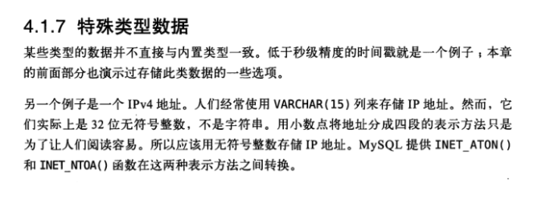
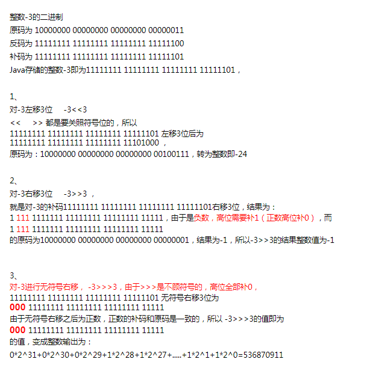
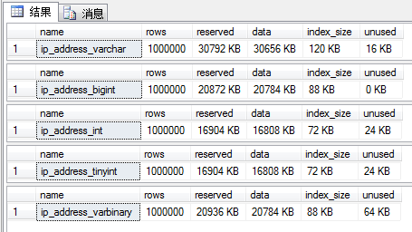

- [MySQL如何有效的存储IP地址？](#mysql如何有效的存储ip地址)
	- [工具类实现转换( -- > com.der.dertool.util.Ipv4Covert)](#工具类实现转换-----comderdertoolutilipv4covert)
	- [数据库函数实现转换](#数据库函数实现转换)
	- [扩展](#扩展)
		- [如何把IP地址保存到Int类型变量中](#如何把ip地址保存到int类型变量中)
			- [实现原理](#实现原理)
	- [论IP地址在数据库中应该用何种形式存储](#论ip地址在数据库中应该用何种形式存储)
		- [可行方法](#可行方法)
		- [测试](#测试)
	- [存储整数IP地址的MySQL性能优势](#存储整数ip地址的mysql性能优势)

# MySQL如何有效的存储IP地址？

一个 int 型的数据占 4 个字节，每个字节 8 位，其范围就是 0~(2^8-1)，而 ipv4地址 可以分成4段，每段的范围是 0~255 刚刚好能存下，所以将其稍稍转换，就巧妙的将 IP地址 用最小的空间存在了数据库中（接下来的描述若无特殊说明，则都是指的 ipv4地址）。可能你会觉得这个小小的改变没有什么关系，但是当数据量越来越多的时候，15个字节和4个字节相差的数据量会让你吃惊。所以在设计数据库的时候，字段类型用合适的，够用就行，能省则省。

正如在《高性能MySQL 第3版》第4.1.7节时，作者建议当存储IPv4地址时，应该使用32位的无符号整数（UNSIGNED INT）来存储IP地址，而不是使用字符串的原理一样。


相对字符串存储，使用无符号整数来存储有如下的好处：
- 节省空间，不管是数据存储空间，还是索引存储空间
- 便于使用范围查询（BETWEEN...AND），且效率更高

通常，在保存IPv4地址时，一个IPv4最小需要7个字符，最大需要15个字符，所以，使用VARCHAR(15)即可。MySQL在保存变长的字符串时，还需要额外的一个字节来保存此字符串的长度。而如果使用无符号整数来存储，只需要4个字节即可。另外还可以使用4个字段分别存储IPv4中的各部分，但是通常这不管是存储空间和查询效率应该都不是很高（虽然有的场景适合使用这种方式存储）。不过使用无符号整数来存储也有不便于阅读和需要手动转换的缺点。

## 工具类实现转换( -- > com.der.dertool.util.Ipv4Covert)

## 数据库函数实现转换
通过数据库自带的函数 INET_ATON 和 INET_NTOA 进行转化：

```mysql
mysql> SELECT INET_ATON('192.168.0.1');
+--------------------------+
| INET_ATON('192.168.0.1') |
+--------------------------+
|               3232235521 |
+--------------------------+
1 row in set

mysql> SELECT INET_NTOA(3232235521);  
+-----------------------+
| INET_NTOA(3232235521) |
+-----------------------+
| 192.168.0.1           |
+-----------------------+
1 row in set
```
如果是 IPv6地址 的话，则使用函数 INET6_ATON 和 INET6_NTOA 进行转化：
```mysql
mysql> SELECT HEX(INET6_ATON('1030::C9B4:FF12:48AA:1A2B'));

+----------------------------------------------+
| HEX(INET6_ATON('1030::C9B4:FF12:48AA:1A2B')) |
+----------------------------------------------+
| 1030000000000000C9B4FF1248AA1A2B             |
+----------------------------------------------+
1 row in set

mysql> SELECT INET6_NTOA(UNHEX('1030000000000000C9B4FF1248AA1A2B')); 
+-------------------------------------------------------+
| INET6_NTOA(UNHEX('1030000000000000C9B4FF1248AA1A2B')) |
+-------------------------------------------------------+
| 1030::c9b4:ff12:48aa:1a2b                             |
+-------------------------------------------------------+
1 row in set
```
然后数据库定义为 varbinary 类型，分配 128bits 空间（因为 ipv6采用的是128bits，16个字节）；或者定义为 char 类型，分配 32bits 空间。

用数据库的函数的话，只需要在 IP地址 入库时，稍稍做一下转换即可，方便快捷；而且到了这里，你不觉得将 IP地址 转换成数字存储是一种不错的选择么，毕竟数据库都帮我们考虑到了这一点，也间接性的证明了这的确是一种可行、并且不错的存储方式。

## 扩展
### [如何把IP地址保存到Int类型变量中](https://www.jianshu.com/p/1090044c3522)
**Int**是java的原始数据类型，JDK定义Int有4个字节共32位。因为int类型存在正数和负数，32位中有一位是来标识正负数的，所以int类型的变量最大和最小值是：0111....11和1111...11（二进制），转化为十进制也就是-2147483648和2147483648

**Java运算符**
> 1. 位与运算符（&）：两个数都转为二进制，然后从高位开始比较，如果两个数都为1则为1，否则为0。
> 2. 位或运算符（ |）：两个数都转为二进制，然后从高位开始比较，两个数只要有一个为1则为1，否则就为0。
> 3. 左移运算符（<<）：value << num，num 是要向左左移动的位数，丢弃最高位，0补最低位。
> 4. 右移运算符（>>）：value << num，num 是要向右 移动的位数，符号位不变，左边补上符号位（正数0负数1）。
> 5. 无符号右移运算符（>>>）：无符号右移规则和右移运算是一样的，只不过忽略了符号位扩展，0补最高位。
> 6. 正数的位移没有涉及到符号，而且正数的原码、反码、补码都是一样的，所以相对简单，但是对于负整数的位移，往往容易混淆。例如对整数-3进行<< >> >>>运算做说明：


#### 实现原理
ipv4的地址可分解为4段，每段范围0-255；int类型的变量同样也有4个字节，每个字节的上限也是255（11111111）且每个字节有8位，结合这两个特性，可以把IP的地址的每一段分别对应到int的每一个字节当中，因为要存储到一个int变量中，所以要在存储时要依次位移8位，这样的话一个IP便可保存在一个int型变量中。


## [论IP地址在数据库中应该用何种形式存储](https://www.cnblogs.com/skynet/archive/2011/01/09/1931044.html)
**三个因素**：
- 可读性
- 存储效率
- 查询效率

### 可行方法
| 数据类型     | 大小        | 注释                                                                                                         |
| ------------ | ----------- | ------------------------------------------------------------------------------------------------------------ |
| varchar(15)  | 占7～15字节 | 可读性最好（192.168.120.65），但是最费存储空间                                                               |
| bigint       | 8 字节      | 可以将ip地址存储为类似192168120065的格式，这种可读性稍差，也比较费存储空间                                   |
| int          | 4 字节      | 这种可读性很差，会存储为1084782657，由192*16777216+168*65536+120*256+65-2147483648计算所得，占用存储空间少。 |
| tinyint      | 4 字节      | 用4个字段来分开存储ip地址，可读性稍差（分别为192， 168， 120， 65），存储空间占用少                          |
| varbinary(4) | 4 字节      | 可读性差（0xC0A87841），存储空间占用少                                                                       |
从大小来看，依次varchar(15)> bigint> int、tinyint、varbinary(4)。
从可读性来看，依次是varchar(15)> bigint> tinyint> varbinary(4)>int。
从查询效率来看，
综合考虑，似乎tinyint比较好，其次是varbinary(4)。但是tinyint需要占多个表字段，而varbinary只需要占用一个字段即可。

### 测试
```mysql
create database ip_address_test;
go

use ip_address_test
/*****it defines ip address as varchar(15)*****/
create table ip_address_varchar(
	id int identity(1,1) not null primary key,
	ipAddress varchar(15)
);
/*****it defines ip address as bigint*****/
create table ip_address_bigint(
	id int identity(1,1) not null primary key,
	ipAddress bigint
);
/*****it defines ip address as int*****/
create table ip_address_int(
	id int identity(1,1) not null primary key,
	ipAddress int
);
/*****it defines ip address as tinyint*****/
create table ip_address_tinyint(
	id int identity(1,1) not null primary key,
	ip_address1 tinyint,
	ip_address2 tinyint,
	ip_address3 tinyint,	
	ip_address4 tinyint
);
/*****it defines ip address as varbinary(4)*****/
create table ip_address_varbinary(
	id int identity(1,1) not null primary key,
	ipAddress1 varbinary(4)
);


/*****insert data into tables*****/
declare @i int, @ip varchar(15)
set @i = 0
set @ip = '192.168.120.65'
while @i < 1000000 
begin 
	/**** insert into ip_address_varchar values ****/
    insert ip_address_varchar values(@ip) 

	/**** insert into ip_address_bigint values ****/
	insert ip_address_bigint values(
		convert( bigint,
			right('000'+convert(varchar(3), parsename(@ip, 4)),3)+
			right('000'+convert(varchar(3), parsename(@ip, 3)),3)+
			right('000'+convert(varchar(3), parsename(@ip, 2)),3)+
			right('000'+convert(varchar(3), parsename(@ip, 1)),3)
		)
	)

	/**** insert into ip_address_int values ****/
    insert ip_address_int values(
			cast(
				(cast(parsename(@ip, 4) as bigint)*16777216)+
				(cast(parsename(@ip, 3) as bigint)*65536)+
				(cast(parsename(@ip, 2) as bigint)*256)+
				cast(parsename(@ip, 1) as bigint)
				-2147483648
			as int)
	) 
 
	/**** insert into ip_address_tinyint values ****/
    insert ip_address_tinyint values(
			convert(tinyint, parsename(@ip, 4)),
			convert(tinyint, parsename(@ip, 3)),
			convert(tinyint, parsename(@ip, 2)),
			convert(tinyint, parsename(@ip, 1))
	) 
 
	/**** insert into ip_address_varbinary values ****/
    insert ip_address_varbinary values(
		cast( convert(tinyint, parsename(@ip, 4)) as varbinary)+
		cast( convert(tinyint, parsename(@ip, 3)) as varbinary)+
		cast( convert(tinyint, parsename(@ip, 2)) as varbinary)+
		cast( convert(tinyint, parsename(@ip, 1)) as varbinary)
	)

    set @i = @i + 1 
end
```
执行存储过程sp_spaceused查看空间效率，执行下面的sql语句：
```mysql
exec sp_spaceused ip_address_varchar
exec sp_spaceused ip_address_bigint
exec sp_spaceused ip_address_int
exec sp_spaceused ip_address_tinyint
exec sp_spaceused ip_address_varbinary
```
**结果**：



字段释义
| 列名       | 数据类型    | 说明                                       |
| ---------- | ----------- | ------------------------------------------ |
| reserved   | varchar(18) | 由数据库中对象分配的空间总量               |
| data       | varchar(18) | 数据使用的空间总量                         |
| index_size | varchar(18) | 索引使用的空间总量。                       |
| unused     | varchar(18) | 为数据库中的对象保留但尚未使用的空间总量。 |

**_所以从可读性和空间效率上来看，最理想的是用tinyint的数据类型存储ip地址。其次应该考虑varbinary(4)和bigint。_**

如果考虑存储效率，tinyint是最好的！其次是bigint，然后是varbinary(4)
如果更多的是考虑查询效率，bigint是最好的！其次是varbinary(4)，然后是tinyint

## [存储整数IP地址的MySQL性能优势](https://bafford.com/2009/03/09/mysql-performance-benefits-of-storing-integer-ip-addresses/)

**结论**…
每个插入查询仅相差12微秒，如果您不对存储的IP进行很多查询，那么更改现有数据库可能就没有意义。但是，如果要进行IP范围查询，则可能要转换表。默认情况下，任何新开发都应将IP地址存储为整数形式的数据库。节省空间和时间是值得的。

一旦IPv6变得更加流行，节省的钱只会越来越大：以“人类可读”格式表示的128位（16字节）IPv6地址最长可以包含39个字符。（由于MySQL没有本机16字节宽的数据类型，因此在数据库中存储IPv6地址将变得更加困难。）

通过在应用程序中执行该转换，而不是使用MySQL的INET_ATON（）函数，可以稍微减少插入整数IP时MySQL的负载。