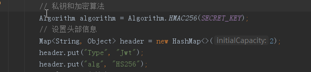

# jwt实现token验证

## pom文件导入依赖
```
<dependency>
       <groupId>com.auth0</groupId>
       <artifactId>java-jwt</artifactId>
       <version>3.2.0</version>
 </dependency>
```

## 工具类，这里叫JWTUtil，
主要包含了生成签名、验证、获取token这几个基本方法，这些说一下加密算法和头部信息：
头信息Header：描述JWT基本信息，typ表示采用JWT令牌，alg(algorithm)表示采用什么算法进行签名，常见算法有HmacSHA256（HS256）、HmacSHA384（HS384）、HmacSHA512（HS512）、SHA256withECDSA（ES256）、SHA256withRSA（RS256）、SHA512withRSA（RS512）等。如果采用HS256则头信息结构为：

`com.der.dertool.util.JwtUtils`


##  ~~引入Cookie的SameSite防止CSRF攻击(spring-boot2.x)~~  【session共享用】
~~SameSite Cookie 是用来防止CSRF攻击，它有两个值：Strict、Lax~~
- ~~SameSite = Strict：~~
    - ~~意为严格模式，表明这个cookie在任何情况下都不可能作为第三方cookie；~~
- ~~SameSite = Lax：~~
    - ~~意为宽松模式，在GET请求是可以作为第三方cookie，但是不能携带cookie进行跨域post访问~~
```text
<dependency>
    <groupId>org.springframework.session</groupId>
    <artifactId>spring-session-core</artifactId>
</dependency>

@Configuration
public class SpringSessionConfig {

    @Bean
    public CookieSerializer httpSessionIdResolver() {
        DefaultCookieSerializer cookieSerializer = new DefaultCookieSerializer();
        // 强限制同一站点设置
        cookieSerializer.setSameSite("Strict");
        return cookieSerializer;
    }
}
```

## 使用注解方式开发访问
```text
import java.lang.annotation.ElementType;
import java.lang.annotation.Retention;
import java.lang.annotation.RetentionPolicy;
import java.lang.annotation.Target;

@Target({ElementType.METHOD, ElementType.TYPE})
@Retention(RetentionPolicy.RUNTIME)
public @interface JwtTokenPass {

    /**
     * 是否需要验证权限
     * @return
     */
    boolean required() default true;

}
```

## 登录授权jwt
```text
import com.der.dertool.annotations.JwtTokenPass;
import com.der.dertool.constants.DerResponse;
import com.der.dertool.util.JwtUtils;
import com.der.dertool.vo.UserVo;
import org.apache.commons.lang3.StringUtils;
import org.springframework.web.bind.annotation.RequestMapping;
import org.springframework.web.bind.annotation.RestController;

import javax.servlet.http.Cookie;
import javax.servlet.http.HttpServletResponse;

@RestController
@RequestMapping("user")
public class JwtUserController {

    @JwtTokenPass
    @RequestMapping("login")
    public DerResponse login(UserVo userVo, HttpServletResponse response) {
        if (null == userVo || StringUtils.isAnyBlank(userVo.getPassword(), userVo.getUsername())) {
            return DerResponse.openFail();
        }
        if (!"K0790016".equals(userVo.getUsername()) || !"Admin@123".equals(userVo.getPassword())) {
            return DerResponse.openFail();
        }
        String sign = JwtUtils.sign(userVo.getUsername(), userVo.getPassword());
        if (null == sign) {
            return DerResponse.openFail();
        }
        Cookie cookie = new Cookie("access_token", sign);
        cookie.setMaxAge(JwtUtils.EXPIRE_TIME.intValue());
        response.addCookie(cookie);
        return DerResponse.openSuccess();
    }

}
```

## 通过拦截器验证用户信息
```text
com.der.dertool.configuration.interceptor.InterceptorConfig


import org.springframework.context.annotation.Configuration;
import org.springframework.web.servlet.config.annotation.InterceptorRegistry;
import org.springframework.web.servlet.config.annotation.WebMvcConfigurer;

@Configuration
public class InterceptorConfig implements WebMvcConfigurer {

    @Override
    public void addInterceptors(InterceptorRegistry registry) {
        registry.addInterceptor(authenticationInterceptor())
                //排除掉swagger的相关请求
                .excludePathPatterns("/swagger/**", "/v2/api-docs", "/swagger-ui.html", "/swagger-resources/**", "/webjars/**")
                .addPathPatterns("/**");    // 拦截所有请求，通过判断是否有 @JwtTokenPass 注解 决定是否需要登录
    }

    public AuthenticationInterceptor authenticationInterceptor() {
        return new AuthenticationInterceptor();
    }
}

com.der.dertool.configuration.interceptor.AuthenticationInterceptor
import com.alibaba.fastjson.JSON;
import com.der.dertool.annotations.JwtTokenPass;
import com.der.dertool.constants.DerResponse;
import com.der.dertool.enums.StatusCode;
import com.der.dertool.util.JwtUtils;
import com.google.common.base.Charsets;
import com.google.common.collect.Lists;
import org.apache.commons.lang3.StringUtils;
import org.springframework.util.CollectionUtils;
import org.springframework.web.method.HandlerMethod;
import org.springframework.web.servlet.HandlerInterceptor;

import javax.servlet.http.Cookie;
import javax.servlet.http.HttpServletRequest;
import javax.servlet.http.HttpServletResponse;
import java.io.IOException;
import java.lang.reflect.Method;
import java.util.List;
import java.util.stream.Collectors;

import static org.springframework.http.MediaType.APPLICATION_JSON_UTF8_VALUE;

public class AuthenticationInterceptor implements HandlerInterceptor {

    @Override
    public boolean preHandle(HttpServletRequest request, HttpServletResponse response, Object handler) throws Exception {
        if(!(handler instanceof HandlerMethod)){
            return true;
        }
        HandlerMethod handlerMethod= (HandlerMethod) handler;
        Method method = handlerMethod.getMethod();
        //检查是否有权限验证
        if (method.isAnnotationPresent(JwtTokenPass.class)) {
            return true;
        }
        // 从 cookie中取出access_token
        if (null == request.getCookies() || request.getCookies().length == 0) {
            feedbackLoginFail(response);
            return false;
        }
        List<Cookie> cookies = Lists.newArrayList(request.getCookies());
        List<String> tokens = cookies.stream().filter(cookie -> "access_token".equals(cookie.getName())).map(Cookie::getValue).collect(Collectors.toList());
        String token = CollectionUtils.isEmpty(tokens)? null:tokens.get(0);
        if (StringUtils.isBlank(token)) {
            feedbackLoginFail(response, cookies);
            return false;
        }
        String userName = JwtUtils.getUserName(token);
        if (StringUtils.isBlank(userName)) {
            feedbackLoginFail(response, cookies);
            return false;
        }
        //username = K0790016 password = Admin@123
        if (!JwtUtils.verify(token, userName, "Admin@123")) {
            feedbackLoginFail(response, cookies);
            return false;
        }
        return true;
    }

    /**
     * 返回response输出无用户
     * @param response
     */
    private void feedbackLoginFail(HttpServletResponse response) {
        feedbackLoginFail(response, null);
    }

    /**
     * 设置cookie过期，返回response输出无用户
     * @param response httpresponse
     * @param cookies 浏览器cookies
     */
    private void feedbackLoginFail(HttpServletResponse response, List<Cookie> cookies) {
        if (!CollectionUtils.isEmpty(cookies)) {
            cookies.forEach(cookie -> cookie.setMaxAge(0));
        }
        response.setCharacterEncoding(Charsets.UTF_8.name());
        response.setContentType(APPLICATION_JSON_UTF8_VALUE);
        try {
            response.getOutputStream().write(JSON.toJSONString(DerResponse.openFail(StatusCode.NO_USER_ERROR)).getBytes("UTF-8"));
        } catch (IOException e) {
            e.printStackTrace();
        }
    }

}

```
