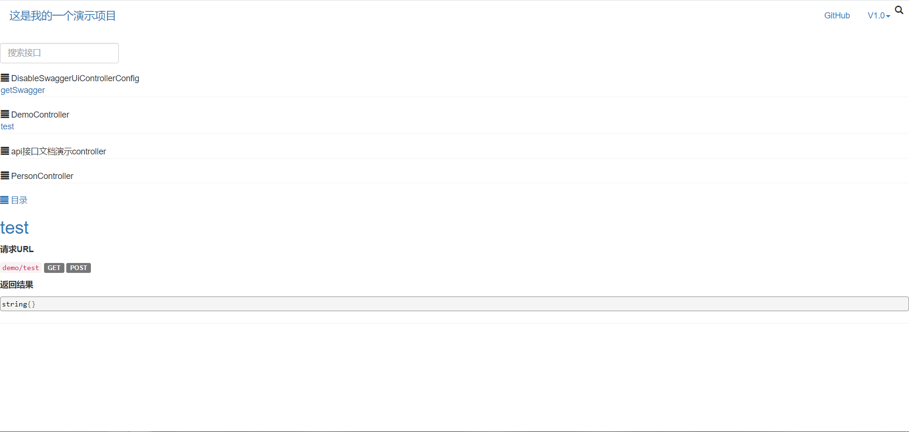
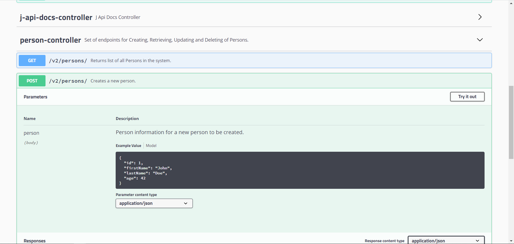

- [springboot 项目生成接口文档](#springboot-项目生成接口文档)
  - [JApiDocs](#japidocs)
  - [apiggs](#apiggs)
  - [swagger](#swagger)

# springboot 项目生成接口文档

## JApiDocs
1. 引入依赖
```
<dependency>
    <groupId>io.github.yedaxia</groupId>
    <artifactId>japidocs</artifactId>
    <version>1.4</version>
</dependency>
```
2. 示例代码
```
com.der.dertool.docs.DocsGenerator
public class DocsGenerator {

    public static void main(String[] args) {
        DocsConfig config = new DocsConfig();
        config.setProjectPath("E:\\ideaworkspace2\\der-tool\\src\\main\\java"); // 项目根目录
        config.setProjectName("这是我的一个演示项目"); // 项目名称
        config.setApiVersion("V1.0");       // 声明该API的版本
        config.setDocsPath("E:\\ideaworkspace2\\der-tool\\src\\main\\java\\com\\der\\dertool\\docs"); // 生成API 文档所在目录
        config.setAutoGenerate(Boolean.TRUE);  // 配置自动生成
//        config.addPlugin(new MarkdownDocPlugin());
        Docs.buildHtmlDocs(config); // 执行生成文档
    }

}
```
3. 效果图


## apiggs
1. 引入插件
```
<!--  apiggs 文档生成 -->
<!--  在编译阶段使用，插件使用更为方便，生成文档格式可以，外加可访问json -->
<plugin>
    <groupId>com.github.apiggs</groupId>
    <artifactId>apiggs-maven-plugin</artifactId>
    <version>1.6</version>
    <executions>
        <execution>
            <phase>compile</phase>
            <goals>
                <goal>apiggs</goal>
            </goals>
        </execution>
    </executions>
    <configuration>
        <id>der-tool</id>
        <title>工具项目标题</title>
        <description>工具项目描述</description>
        <version>V1.0.0</version>
        <dependency>com.der.dertool.web</dependency>
    </configuration>
</plugin>
```
2. 可选选项
> id 项目id，生成id.html文件<br/>
> title 文档标题<br/>
> description 文档描述<br/>
> production 输出文件夹，默认为 apiggs<br/>
> out 输出目录，默认为 target<br/>
> source 源码目录<br/>
> dependency 源码依赖的代码目录，以逗号隔开<br/>
> jar 源码依赖的jar包目录，以逗号隔开<br/>
> ignore 忽略某些类型<br/>
> version 文档版本号<br/>

3. 生成操作
执行mvn compile命令即可

4. 生成文件
在编译目录下生成apiggs文件夹，并生成三个文件：
[.json文件](./html/der-tool.json)，可直接导入postman
[.adoc文件](./html/der-tool.adoc)，Asciidoc源文件
[.html文件](./html/der-tool.html)，浏览器可直接打开

## swagger
1. 引入依赖
```
<!--  swagger 生成文档 -->
<dependency>
    <groupId>io.springfox</groupId>
    <artifactId>springfox-swagger2</artifactId>
    <version>2.9.2</version>
</dependency>
<dependency>
    <groupId>io.springfox</groupId>
    <artifactId>springfox-swagger-ui</artifactId>
    <version>2.9.2</version>
</dependency>
<!--  swagger 生成文档 -->
```

2. 使用
```
@Api：修饰整个类，描述Controller的作用
@ApiOperation：描述一个类的一个方法，或者说一个接口
@ApiParam：单个参数描述
@ApiModel：用对象来接收参数
@ApiProperty：用对象接收参数时，描述对象的一个字段
@ApiResponse：HTTP响应其中1个描述
@ApiResponses：HTTP响应整体描述
@ApiIgnore：使用该注解忽略这个API
@ApiError ：发生错误返回的信息
@ApiParamImplicitL：一个请求参数
@ApiParamsImplicit 多个请求参数
```
[swagger常用注解](./swagger/swagger常用注解.md)

3. 示例
com.der.dertool.web.PersonController
com.der.dertool.vo.PersonVo

4. 效果图


5. Swagger配置全局Response Model
[Swagger配置全局Response Model](./swagger/Swagger配置全局ResponseModel.md)