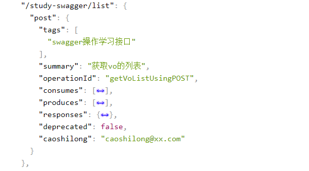
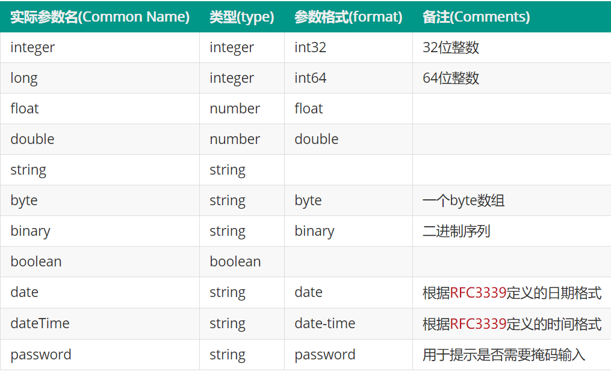

- [swagger常用注解](#swagger常用注解)
  - [Api](#api)
  - [ApiOperation](#apioperation)
  - [ApiParam](#apiparam)
  - [ApiResponse](#apiresponse)
  - [ApiResponses](#apiresponses)
  - [ResponseHeader](#responseheader)
  - [ApiModel](#apimodel)
  - [ApiModelProperty](#apimodelproperty)
  - [ApiImplicitParams](#apiimplicitparams)
  - [ApiImplicitParam](#apiimplicitparam)
  - [ApiIgnore](#apiignore)

# swagger常用注解

**常用注解**

- Api
- ApiModel
- ApiModelProperty
- ApiOperation
- ApiParam
- ApiResponse
- ApiResponses
- ResponseHeader

## Api
Api 用在类上，说明该类的作用。可以标记一个Controller类做为swagger 文档资源，使用方式：
```
@Api(value = "/user", description = "Operations about user")
```
与Controller注解并列使用。 属性配置：
| 属性名称       | 备注                                                         |
| -------------- | ------------------------------------------------------------ |
| value          | 请注意，这个属性在`Swagger2.0`之后的版本中，没有什么实际的意义了。因为在`Swagger2.0`之后的版本中，`Swagger`官网推荐的是使用`tags`属性进行代替，并且，如果我们在`@API`中同时声明了`value`和`tags`，此时`value`的属性会被覆盖掉，同时，对于`tags`属性，我们可以设置多个标签。 |
| tags           | 对于官网，给定的是`API`文档的的控制标签的列表。在实际的使用中，我们经常会将`Controller`进行分类，因此，我们可以采用`tags`标签将我们的请求分类。(主显示，description会显示其右侧小字) |
| description    | 这个属性在`Swagger1.5X`版本中已经不再推荐使用了。因此标记了`@Deprecated`注解。对于这个属性，一般描述的是某个`Controller`的一个详细的具体信息。 |
| basePath       | 这个属性在`Swagger1.5X`版本中已经不再推荐使用了。因此标记了`@Deprecated`注解。标识的是请求的基本路径。 |
| position       | 这个属性在`Swagger1.5X`版本中已经不再推荐使用了。因此标记了`@Deprecated`注解。如果配置多个Api想改变显示的顺序位置 |
| produces       | 指定返回的内容类型，仅当`request`请求头中的(`Accept`)类型中包含该指定类型才返回，例如:`application/json`。 |
| consumes       | 指定处理请求的提交内容类型(`Content-Type`)，例如`application/json`。 |
| protocols      | 标识的是当前的请求支持的协议，例如：`http`、`https`、`ws`、`wss`。 |
| authorizations | 高级特性认证时配置。                                         |
| hidden         | 配置为`true`将在文档中隐藏。隐藏整个`Controller`资源。作用与`@ApiIgnore`类似，但是没有`@ApiIgnore`功能强大。 |

在SpringMvc中的配置如下：
```
@Controller
@RequestMapping(value = "/api/pet", produces = {APPLICATION_JSON_VALUE, APPLICATION_XML_VALUE})
@Api(value = "/pet", description = "Operations about pets")
public class PetController {
}
```

## ApiOperation
ApiOperation：这个注解可以使用在方法上和类的上面，但是一般的情况下， 我们都是用在方法上面。代表的是一个`Http`请求方法的描述。使用方式：
```
@ApiOperation(
          value = "Find purchase order by ID",
          notes = "For valid response try integer IDs with value <= 5 or > 10. Other values will generated exceptions",
          response = Order,
          tags = {"Pet Store"})
```
与Controller中的方法并列使用。属性配置：
| 属性名称          | 备注                                                         |
| ----------------- | ------------------------------------------------------------ |
| value             | 对于`value`属性，表示的是这个方法的一个总结性的描述，在官网的文档中，建议的是我们在描述的时候，尽可能的总结，将字数控制在`120`个字符以为就行。 |
| notes             | 对于`note`属性，标识的是对于一个方法的具体性的描述。         |
| tags              | 如果设置这个值、value的值会被覆盖。 这个操作和之前的`@API`的`tags`属性特别的像，都是给类、请求进行分组、打标签使用的。但是在这里有一点是需要注意的，就是如果同时设置了`@API`的`tags`属性和`@ApiOperation`的`tags`属性，那么此时会通过`@API`的`tags`属性将`Controller`进行分类，而通过`@ApiOperation`的`tags`属性，`Controller`中的请求进行分类。~~（不要写这个，会将显示级别调整到controller级别，样式全乱了）~~ |
| responseReference | 这里设置的是一个相应类型的引用。这个引用可以是本地的，也可以是远程的。如果设置了这个值，将会覆盖`response`属性的值。 |
| position          | 这个属性在`Swagger1.5X`版本中已经不再推荐使用了。因此标记了`@Deprecated`注解，且高版本的已经一移除该功能了（包括后端和前端UI）。如果配置了多个请求方法，想改变显示的顺序位置 |
| produces          | 指定返回的内容类型，仅当`request`请求头中的(`Accept`)类型中包含该指定类型才返回，例如:`application/json`。 |
| consumes          | 指定处理请求的提交内容类型(`Content-Type`)，例如`application/json`。 |
| protocols         | 标识的是当前的请求支持的协议，例如：`http`、`https`、`ws`、`wss`。 |
| authorizations    | 高级特性认证时配置                                           |
| hidden            | 配置为true 将在文档中隐藏                                    |
| response          | 这个属性设置的是当前请求的返回值类型。例如，我们返回的如果是一个`String`的话，那么在这里写的就是 `String.class`。针对有泛型的返回类，最好还是别写，否则影响swagger-ui的页面显示model |
| responseContainer | 在这里，说明的是包装相应的容器。默认情况下，有效值为 `List`、`Set`、`Map`，任何其它值都将被忽略。 |
| responseHeaders   | 指定`response`中`header`的信息列表                           |
| code              | `http`返回状态码                                             |
| extensions        | 可选的扩展数组,举例：`extensions = @Extension(properties ={@ExtensionProperty(name = "author", value = "test@xx.com")})`。v2/api-docs的接口返回对应信息 |
| httpMethod        | "GET", "HEAD", "POST", "PUT", "DELETE", "OPTIONS" and "PATCH"     RequestMapping中保持一致，否则影响 try it out，且只能写一个。不写会默认按照@RequestMapping里的来生成，@RequestMapping里也没规定会这些方式都有一个。 |
| nickname          | 这个字段对应的是`operationId`字段。第三方工具使用`operationId`来唯一表示此操作.在`Swagger2.0`之后的版本中，这个字段是不在强制的，如果没有，则系统默认为空。 |
| ignoreJsonView    | 忽略`JsonView`注解，主要的目的是为了做到向下兼容             |

pringMvc中的配置如下：
```
@RequestMapping(value = "/order/{orderId}", method = GET)
  @ApiOperation(
      value = "Find purchase order by ID",
      notes = "For valid response try integer IDs with value <= 5 or > 10. Other values will generated exceptions",
      response = Order.class,
      tags = { "Pet Store" })
   public ResponseEntity<Order> getOrderById(@PathVariable("orderId") String orderId)
      throws NotFoundException {
    Order order = storeData.get(Long.valueOf(orderId));
    if (null != order) {
      return ok(order);
    } else {
      throw new NotFoundException(404, "Order not found");
    }
  }
```

## ApiParam
ApiParam请求属性,使用方式：
```
public ResponseEntity<User> createUser(@RequestBody @ApiParam(value = "Created user object", required = true)  User user)
```
与Controller中的方法并列使用。

**属性配置**：
| 属性名称         | 备注                                                         |
| ---------------- | ------------------------------------------------------------ |
| name             | 参数名称，参数名称将从 filed/method/parameter 名称中派生，但你可以覆盖它，路径参数必须始终命名为它们所代表的路径部分 |
| value            | 参数简单描述                                                 |
| defaultValue     | 描述参数默认值（try it out 的填写的默认参数）                |
| allowableValues  | 可接收参数值限制，1.第一种是采用枚举的形式。<br/>     例如：`allowableValue="{first, second, third}"`<br/>    2.第二种是采用一个有限的范围，例如`"range[1, 5]"`、`"range(1, 5)"`、`"range[1, 5)"`。其中，<br/>     2.1 `[`表示是大于等于<br/>     2.2 `(`表示是大于<br/>     2.3 `]`表示是小于等于<br/>     2.4 `)`表示是小于<br/>    3.标识的是一个无限的范围。其中，我们使用`infinity`表示无限大，使用`-infinity`表示负无限大。<br/>     例如:`"range[1, infinity]"`。可以不配置（只对swaggerUI页面参数可以限制） |
| required         | 是否为必传参数, false:非必传; true:必传                      |
| access           | 参数过滤，请参阅:io.swagger.core.filter.SwaggerSpecFilter    |
| allowMultiple    | 表示的是允许多个，一般用在`Array`、`List`上面。默认为false   |
| hidden           | 隐藏该属性                                                   |
| example          | 非请求体(body)类型的单个参数示例                             |
| examples         | 参数示例，仅适用于请求体类型的请求                           |
| type             | 参数的类型。这字段适用于`paramType`为非`body`的情况，可选的参数类型为：<br/>    1. string<br/>    2. number<br/>    3. integer<br/>    4. boolean<br/>    5. array<br/>    6. file –如果是file的话，那么`consumes`字段必须是`multipart/form-data`, `application/x-www-form-urlencoded`中的一种或几种。 |
| format           | 添加提供自定义format格式的功能 |
| allowEmptyValue  | 添加将格式设置为空的功能，默认false                          |
| readOnly         | 设置参数是只读模式，不允许修改。                             |
| collectionFormat | 在这里，如果我们的参数类型是一个数组的话，在这里，我们可以设定数组的格式，通常有：<br/>           1. csv—利用逗号,分割值<br/>           2. ssv—利用空格分割值<br/>           3. tsv—利用制表符\t分割值<br/>           4. pipes—利用管道<br/>           5. multi—多元素分割值。<br/>默认情况下，是csv格式的。 |

在SpringMvc中的配置如下：
```
public ResponseEntity<Order> getOrderById(
      @ApiParam(value = "ID of pet that needs to be fetched", allowableValues = "range[1,5]", required = true)
      @PathVariable("orderId") String orderId)
```


## ApiResponse

ApiResponse：响应配置，使用方式：

```
@ApiResponse(code = 400, message = "Invalid user supplied")
```

与Controller中的方法并列使用。 属性配置：

| 属性名称          | 备注                                                         |
| ----------------- | ------------------------------------------------------------ |
| code              | http的状态码                                                 |
| message           | 响应码对应的描述                                             |
| response          | 描述的是返回的类型，默认响应类 Void                          |
| reference         | 参考ApiOperation中配置                                       |
| responseHeaders   | 指定`response`中`header`的信息列表                           |
| responseContainer | 在这里，说明的是包装相应的容器。默认情况下，有效值为 `List`、`Set`、`Map`，任何其它值都将被忽略 |
| examples          | `response`返回的举例说明                                     |

在SpringMvc中的配置如下：

```
 @RequestMapping(value = "/order", method = POST)
  @ApiOperation(value = "Place an order for a pet", response = Order.class)
  @ApiResponses({ @ApiResponse(code = 400, message = "Invalid Order") })
  public ResponseEntity<String> placeOrder(
      @ApiParam(value = "order placed for purchasing the pet", required = true) Order order) {
    storeData.add(order);
    return ok("");
  }
```

## ApiResponses

ApiResponses：响应集配置，使用方式：

```
 @ApiResponses({ @ApiResponse(code = 400, message = "Invalid Order") })
```

与Controller中的方法并列使用。 属性配置：

| 属性名称 | 备注                |
| -------- | ------------------- |
| value    | 多个ApiResponse配置 |

在SpringMvc中的配置如下：

```
 @RequestMapping(value = "/order", method = POST)
  @ApiOperation(value = "Place an order for a pet", response = Order.class)
  @ApiResponses({ @ApiResponse(code = 400, message = "Invalid Order") })
  public ResponseEntity<String> placeOrder(
      @ApiParam(value = "order placed for purchasing the pet", required = true) Order order) {
    storeData.add(order);
    return ok("");
  }
```

## ResponseHeader

响应头设置，使用方法

```
@ResponseHeader(name="head1",description="response head conf")
```

与Controller中的方法并列使用。 属性配置：

| 属性名称          | 备注                   |
| ----------------- | ---------------------- |
| name              | 响应头名称             |
| description       | 头描述                 |
| response          | 默认响应类 Void        |
| responseContainer | 参考ApiOperation中配置 |

## ApiModel

`@ApiModel`这个注解是比较重要的一个注解。因为在实际的开发过程中，我们知道了请求的地址后，我们更加重要的是关心这个接口的请求入参和返回值。而对于`@ApiModel`这个注解,可以良好的展示出请求参数的含义和返回参数的含义。这个注解的是作用在类上面的，是用来描述类的一些基本信息的。

与Controller中的方法参数一起使用。 属性配置：

| 属性名称      | 备注                                                         |
| ------------- | ------------------------------------------------------------ |
| value         | 类的一个备用名。如果我们不设置的的话，那么默认情况下，将使用的是`class`类的名字。 |
| description   | 对于类，提供一个详细的描述信息                               |
| parent        | 这个属性，描述的是类的一些父类的信息。                       |
| discriminator | 这个属性解释起来有些麻烦，因为这个类主要是体现出了断言当中。 |
| subTypes      | 举个实例，如果我们此时有一个父类`Animal`。同时，对于这个父类，我们的系统中有这个类的子类`Cat`、`Dog`、`Pig`等。如果我们在我们的父类上，通过这个属性，指定了我们想要使用的子类的话，那么在生成`Swagger`的文档的话，会自动的展示的是`Animal`这个属性，但是在属性的字段中，会显示出子类的一些独有的属性，其实在这里，是不推荐使用的。因为这样会让别人认为，这些子类独有的属性，也是父类才有的。 |
| reference     | 指定对相应类型定义的引用，覆盖指定的任何其他元数据。         |

## ApiModelProperty

这个注解是配合`@ApiModel`注解一起使用的。同时这个注解与`@ApiModel`不同，`@ApiModel`是描述的是类的信息，而`@ApiModelProperty`属性描述的是类的属性的信息。

| 属性名称        | 备注                                                         |
| --------------- | ------------------------------------------------------------ |
| value           | 简洁的介绍字段描述。                                         |
| name            | 如果设置这个字段，会覆盖原本属性的名字。                     |
| allowableValues | 标明字段的取值范围，设置的方式有三种<br/>    1.第一种是采用枚举的形式。<br/>     例如：`allowableValues="first, second, third"`<br/>    2.第二种是采用一个有限的范围，例如`"range[1, 5]"`、`"range(1, 5)"`、`"range[1, 5)"`。其中，<br/>     2.1 `[`表示是大于等于<br/>     2.2 `(`表示是大于<br/>     2.3 `]`表示是小于等于<br/>     2.4 `)`表示是小于<br/>    3.标识的是一个无限的范围。其中，我们使用`infinity`表示无限大，使用`-infinity`表示负无限大。<br/>     例如:`"range[1, infinity]"`。 |
| access          | 这个属性的意思是允许从API文档中过滤属性，详情，我们可以参见`io.swagger.core.filter.SwaggerSpecFilter` |
| notes           | 预留字段，目前并未被使用(可以当做value使用)                  |
| dataType        | 参数的数据类型，如果我们设置了这个属性，将被覆盖掉通过内省获得的参数的数据类型。并且这个数据类型可以是基本数据类型，也可以是类的名字。如果是基本数据类型，为了防止抛出`java.lang.NumberFormatException: For input string: ""`的错误<br/>    1.我们可以采用配置`example`属性一起使用<br/>    2.我们可以通过修改`swagger-annotations`和`swagger-models`的版本来避免，修改到`1.6.0`版本即可。 |
| required        | 当前字段是否是必须的，默认是`false`。                        |
| position        | 已过时的方法，代表是属性在文档中的位置排序。                 |
| hidden          | 表示的是是否隐藏当前字段，默认是`false`。                    |
| example         | 举例说明。                                                   |
| readOnly        | 过时方法，在`Swagger1.5.19`版本之后，采用`accessMode`注解代替。 |
| accessMode      | 访问模式，可通过`allowableValues="AUTO, READ_ONLY, READ_WRITE"`来限制，目前的模式有AUTO, READ_ONLY, READ_WRITE |
| reference       | 指定了属性的类型引用，如果设置了当前属性，会覆盖任何其他的元数据(`不常使用`)。 |
| allowEmptyValue | 是否允许该字段为空，默认是`false`。                          |
| extensions      | 该属性用于进行额外的描述。是一个可选项的数组组成。           |

## ApiImplicitParams

用来描述方法的请求参数的。例如我们在做`MVC`的开发过程中，当我们需要别人给我们传递参数的时候，我们就可以使用这样的注解，而在我们的代码当中，我们可以使用`Request request`进行接收。使用方式：

```
@ApiImplicitParams({
    @ApiImplicitParam(name = "name", value = "User's name", required = true, dataType = "string", paramType = "query"),
    @ApiImplicitParam(name = "email", value = "User's email", required = false, dataType = "string", paramType = "query"),
    @ApiImplicitParam(name = "id", value = "User ID", required = true, dataType = "long", paramType = "query")
  })
 public void doPost(HttpServletRequest request, HttpServletResponse response) throws ServletException, IOException {...}
```

与Controller中的方法并列使用。 属性配置：

| 属性名称         | 备注                   |
| ---------------- | ---------------------- |
| ApiImplicitParam | ApiImplicitParam的数组 |

## ApiImplicitParam

描述请求参数的一些基本信息。

与Controller中的方法并列使用。 属性配置：

| 属性名称         | 备注                                                         |
| ---------------- | ------------------------------------------------------------ |
| name             | 请求参数的名字，如果在你的代码中，设置了`paramType`,则该属性代表的是请求路径中的某个关联值，如果没有设置`paramType`属性，则name代表的就是普通的参数的名字。 |
| value            | 参数的简明描述。                                             |
| defaultValue     | 参数默认值                                                   |
| allowableValues  | 标明字段的取值范围，设置的方式有三种<br/>    1.第一种是采用枚举的形式。<br/>     例如：`allowableValue="{first, second, third}"`<br/>    2.第二种是采用一个有限的范围，例如`"range[1, 5]"`、`"range(1, 5)"`、`"range[1, 5)"`。其中，<br/>     2.1 `[`表示是大于等于<br/>     2.2 `(`表示是大于<br/>     2.3 `]`表示是小于等于<br/>     2.4 `)`表示是小于<br/>    3.标识的是一个无限的范围。其中，我们使用`infinity`表示无限大，使用`-infinity`表示负无限大。<br/>     例如:`"range[1, infinity]"`。 |
| required         | 是否是必传字段，默认`是false`。                              |
| access           | 这个属性的意思是允许从API文档中过滤属性，详情，我们可以参见`io.swagger.core.filter.SwaggerSpecFilter` |
| allowMultiple    | 表示的是允许多个，一般用在`Array`、`List`上面。              |
| dataType         | 参数的数据类型，如果我们设置了这个属性，将被覆盖掉通过内省获得的参数的数据类型。并且这个数据类型可以是基本数据类型，也可以是类的名字。如果是基本数据类型，为了防止抛出`XXX`的错误<br/>    1.我们可以采用配置`example`属性一起使用<br/>    2.我们可以通过升级`swagger-annotations`和`swagger-models`的版本来避免，修改到`1.6.0`版本即可。 |
| dataTypeClass    | 指定参数的class文件。如果我们在设置中提供了该参数，将自动的覆盖掉`dataType`参数。 |
| paramType        | 参数的参数类型，一般有：<br/>    1. path<br/>    2. query<br/>    3. body<br/>    4. header<br/>    5. form |
| example          | 对于非`body`类型的参数的一个举例说明。                       |
| examples         | 参数的举例说明，仅适用于`body`类型。                         |
| type             | 参数的类型。这字段适用于`paramType`为非`body`的情况，可选的参数类型为：<br/>    1. string<br/>    2. number<br/>    3. integer<br/>    4. boolean<br/>    5. array<br/>    6. file –如果是file的话，那么`consumes`字段必须是`multipart/form-data`, `application/x-www-form-urlencoded`中的一种或几种。 |
| format           | 自定义参数的格式。 |
| allowEmptyValue  | 允许参数为空，模式是`false`。                                |
| readOnly         | 设置参数是只读模式，不允许修改。                             |
| collectionFormat | 在这里，如果我们的参数类型是一个数组的话，在这里，我们可以设定数组的格式，通常有：<br/>           1. csv—利用逗号,分割值<br/>           2. ssv—利用空格分割值<br/>           3. tsv—利用制表符\t分割值<br/>           4. pipes—利用管道<br/>           5. multi—多元素分割值。<br/>默认情况下，是csv格式的。 |

## ApiIgnore

`Swagger`生成文档的时候，自动忽略掉、隐藏掉打上该注解的内容。

属性配置：

| 属性名称 | 备注                               |
| -------- | ---------------------------------- |
| value    | 简明的说明为什么要忽略掉这个参数。 |